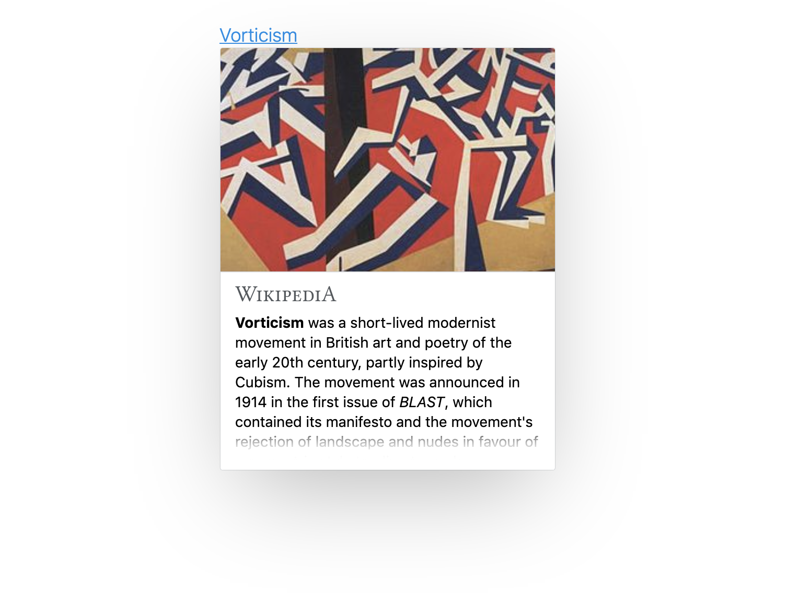

# Wikipedia Context Cards

Get Wikipedia page previews on any page!

<p align="center">
  
</p>

See some live examples at <https://joakin.github.io/context-cards>, or check our
[UI tests](https://joakin.github.io/context-cards/test.html) for examples of
many previews.

## How to use

Include the library in your page:

```
https://unpkg.com/context-cards/dist/context-cards.js
```

Mark some links with `data-wiki-title` and `data-wiki-lang`.

```html
<ul>
  <li>
    <a href="#" data-wiki-lang="en" data-wiki-title="Cake">Cake</a>
  </li>
  <li>
    <a href="#" data-wiki-lang="ca" data-wiki-title="Pastís">Pastís</a>
  </li>
</ul>
```

Those links should show the previews now on hover and focus!

### Right to left languages: previews and content

If you add a link with a language that is right to left, the preview content
will automatically show up appropriately
([example](https://chimeces.com/context-cards/test.html#LTR%20CONTENT,%20RTL%20POPUP%20-%20%D7%A4%D7%A8%D7%94%D7%99%D7%A1%D7%98%D7%95%D7%A8%D7%99%D7%94)).

If the content of your page is right to left, and you have the `dir` attribute
set on any of the parent elements of the link, or the link itself, then things
should work fine by default, by positioning the card anchored to the bottom
right of your link.

If you are doing something strange with your content and don't have those
attributes, you can manually add `dir="rtl"` to the link and the card will work
as intended.

### Dynamic content

Sometimes you have content that loads later on the page, and is not there on
`DOMContentLoaded`. If that is the case, you will need to tell context cards to
refresh the links so that it can bind its interactions as needed.

When including the script in the page, context cards binds itself to
`window.ContextCards`. If you need to tell it to refresh the links and search
for new ones, you can call `ContextCards.bindLinks()`. That should appropriately
bind the event handlers for the new links marked with the `data` attributes
mentioned above.

### Self hosting the script file

If you don't want to use a npm CDN like unpkg, you can always get the script
file for the popups from the npm package after installing it, in the
`dist/context-cards.js` file.

Another alternative is getting it from this git repo. The file you can include
is always in `dist/context-cards.js`, and you can get it from the master branch,
or from the git tags which match the npm versions.

## Credits

Based on the original work on
[Extension:Popups](https://mediawiki.org/wiki/Extension:Popups).
